## 本地SUPABASE数据库

### 启动与关闭
> 打开Docker Desktop，找到Supabase,，按钮启动与关闭(不用的时候要关闭，玉面因为安全漏洞损坏电脑数据)

### 首次安装与配置

```mermaid
flowchart TD
    A[开始: 本地自托管官方仓库<br>Supabase Docker] --> |前提条件|B[安装 Docker Desktop<br> 「包含 Docker Compose」] 
    B--> C[
    1. # 克隆官方仓库<br>git clone https://github.com/supabase/supabase
    2. # 跳转到仓库目录<br>cd supabase/docker
    3. # 复制环境文件<br>cp .env.example .env
    ]
    C--> |关键步骤: 生成匹配的 API Keys|E[
    1.打开官网生成器:<br>https://supabase.com/docs/guides/self-hosting/docker#generate-api-keys
    2. 输入强 JWT_SECRET 「≥32字符，随机生成」
    3. 选择 role: anon → 生成 ANON_KEY
    4.. 选择 role: service_role → 生成 SERVICE_ROLE_KEY
    ] --> |编辑 .env 文件，粘贴KEY|F[
    1. JWT_SECRET=你的secret
    2. ANON_KEY=生成的 anon JWT
    3. SERVICE_ROLE_KEY=生成的 service_role JWT
    4. 同时设置:<br>POSTGRES_PASSWORD=强密码<br>DASHBOARD_USERNAME/PASSWORD 「Studio 登录用」
    5. 可选: 自定义 schema 暴露<br>PGRST_DB_SCHEMAS=public,storage,graphql_public,narration] -->
    G[
    1. # 第一次启动 「命令行」<br>docker compose up -d
    2. # 命令行重启「清理旧数据/缓存」」<br>先执行 docker compose down -v <br>再执行 docker compose up -d] -->
    H[后续日常启动/关闭
    1. 使用 Docker Desktop
    2. 打开 Docker Desktop
    3. 在 Containers 列表找到 supabase 项目
    4. 点击 Start / Stop 按钮] -->
    I[环境变量修改时 「必须命令行彻底重启」<br>例如修改 .env 或 kong.yml 后
    1. # 跳转目录<br>cd supabase/docker
    2. # 清理旧数据/缓存<br>docker compose down -v 
    3. # 重新启动<br>docker compose up -d] -->
    J[检查运行状态<br>Docker Desktop 查看所有容器 Running 「healthy」<br>或命令行: docker compose ps] -->
    K[访问 Studio 测试<br>浏览器 http://localhost:8000<br>用 DASHBOARD_USERNAME/PASSWORD 登录] -->
    L[Next.js 项目配置 「.env.local」
    1. SUPABASE_URL=http://localhost:8000
    2. SUPABASE_ANON_KEY= .env 中的 ANON_KEY 「完整 JWT」
    3. SUPABASE_SCHEMA=narration
    4. SUPABASE_SERVICE_ROLE_KEY= .env 中的 SERVICE_ROLE_KEY 「完整 JWT」
    5. # 注意: SERVICE_ROLE_KEY 不要加 NEXT_PUBLIC_ 前缀 「服务器端专用」] -->
    M[创建 Supabase Client「参见supabase.ts代码」] -->
    N[测试访问数据库
    1. 客户端查询 public 表 → 用 supabase
    2. 查询 narration schema 或绕过 RLS → 用 supabaseAdmin
    3. 成功返回数据 → 部署完成！] -->
    O[常见问题修复
    1. Unauthorized 报错，检查 ANON_KEY 配置是否相同
    2. 彻底重启，先执行docker compose down -v <br>再执行docker compose up -d
    3. 自定义 schema: 确认 PGRST_DB_SCHEMAS 包含 narration
    4. GRANT USAGE ON SCHEMA narration TO anon;
    5. 第一次启动后耐心等所有容器 healthy]
    style E fill:#ffcccc,stroke:#f66,stroke-width:3px,color:#000
    style I fill:#ffff99,stroke:#f90,stroke-width:2px
    style N fill:#ccffcc,stroke:#0f0,stroke-width:3px,color:#000
```

## 本地Webhook回调

### Clerk
> Clerk的回调地址是直接在Clerk的后台配置的，为了方便多个项目统一调试，即所有项目使用相同的回调地址
> 因而约定回调地址同于约定为 https://ddaas-clerk.loca.lt/api/clerk/webhook
- 本地调试域名为 **`ddaas-clerk.loca.lt`**，API路径为 **`/api/clerk/webhook`**
- 这样本地命令行建立通道的时候，统一使用命令 **`npx localtunnel --port 3000 --subdomain ddaas-clerk`**，只需要注意两点，本地项目的端口号确认是3000，没有其他项目在运行；也没有多个本地项目同时进行clerk回调测试(避免事件混乱)

### Stripe

#### 沙盒环境约定
> Stripe提供了CLI工具，可以很方面的管理沙盒环境和回调行为，但是多个项目会使用不同的环境，很容易在本地调试时忽略环境问题：环境不同秘钥也不同，还有不同项目之间的Stripe API版本也会有差异
> 因而约定：每个项目的Stripe API沙盒环境版本和线上环境版本一定要会保持一致，这也是上线检查步骤
> 并且引入的Stripe包的版本，必须使用精准名称而非范围版本名
> - 例如`18.5.0`，
> - 而不是<del><strong>^18.5.0</strong></del>
> - 也不是<del><strong>latest</strong></del>
> - 避免自动升级版本引发漏测问题导致线上事故
- 沙盒开发环境
  - **template 沙盒**：对应zcy的narration等本地调试环境
  - **NextAI-Build**：对应d8ger的nextai、diaomao等本地调试环境
- 沙盒预生产环境，**Diaomao生产as预发**：这是Diaomao项目的生产环境

#### webhook调试
- 登录沙盒环境，**`stripe login`**，会自动引导到界面进行授权登录以及沙盒环境选择，成功后命令行会给出当前沙盒环境的回调认证秘钥，这个秘钥和项目的环境变量配置比对，即可确定当前使用的是哪个沙盒环境
- 查看当前沙盒环境，**`stripe config --list`**，会告诉你沙盒名称、对接秘钥，过期时间等
- 开启Stripe监听
  - 对于模板项目，统一使用 **`stripe listen --forward-to localhost:3000/api/webhook/stripe`**，确认端口**3000**，确认API路径为 **`/api/webhook/stripe`**
  - 对于narration项目或其他自行搭建的项目，可能使用的命令则为 **`stripe listen --forward-to localhost:3000/api/payments/webhook`**，务必确认端口**3000**！，务必确认API路径为 **`/api/payments/webhook`**！