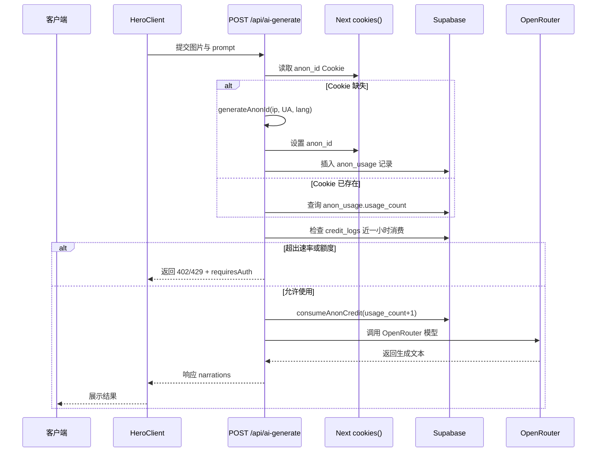
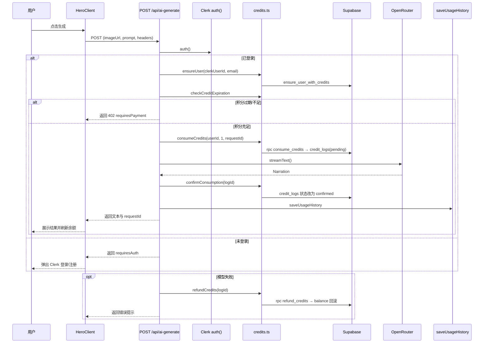
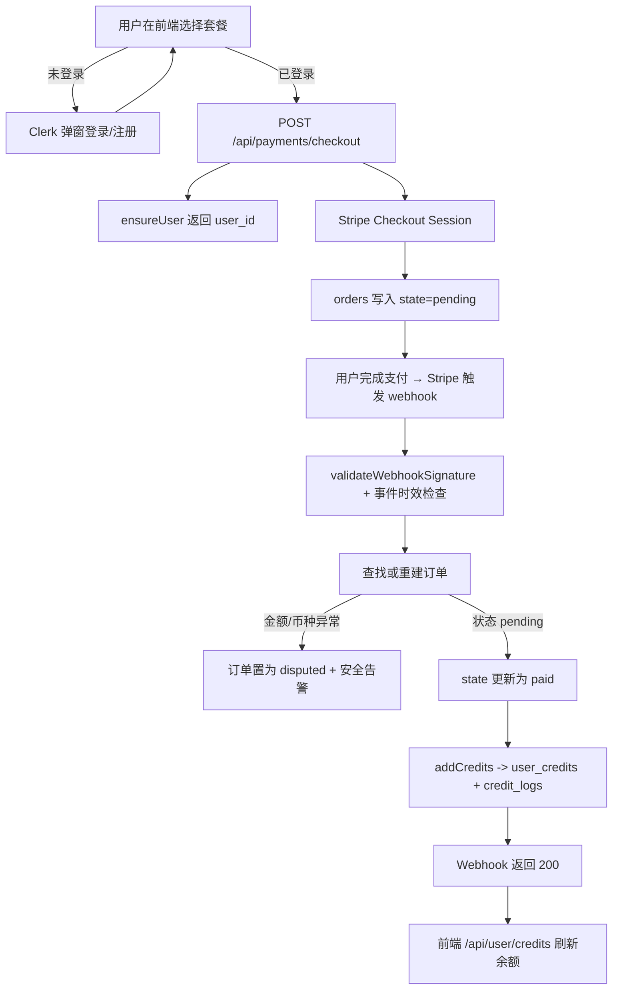

# 匿名用户 / 登录 / 支付 / 积分逻辑说明

## 1. 概览

- **产品定位**：为上传图片并生成 AI 解说的应用，提供匿名试用、注册用户积分消费与 Stripe 支付充值的完整闭环。
- **核心依赖**：Clerk 负责身份与登录，Supabase 保存用户、订单与积分状态，Stripe 承担支付与 Webhook 回调，OpenRouter 提供模型输出。
- **主要文件**：
  - 认证/鉴权：`src/middleware.ts`、`src/app/[locale]/layout.tsx`、`src/components/clerk-user.tsx`、`src/components/clerk-user-client.tsx`
  - 匿名逻辑：`src/lib/anonymous.ts`、`src/app/api/anonymous-usage/route.ts`
  - 积分与支付：`src/lib/credits.ts`、`src/app/api/payments/checkout/route.ts`、`src/app/api/payments/webhook/route.ts`、`src/app/api/cron/expire-credits/route.ts`
  - AI 调用：`src/app/api/ai-generate/route.ts`、`src/components/hero-client.tsx`
  - 数据建模：`supabase/migrations/20250922_create_payment_tables.sql`、`supabase/migrations/20250923_001_create_rpc_functions.sql`

## 2. 数据与服务基石

- **Supabase 表结构**（见 `supabase/migrations/20250922_create_payment_tables.sql`）：
  - `users` / `user_credits`：保存注册用户与其余额、过期时间。
  - `credit_logs`：所有积分变动（充值、消费、过期），通过 `(type, ref_id)` 唯一索引支撑幂等。
  - `anon_usage`：匿名访客使用计数与指纹（HMAC IP、UA）。
  - `orders`：Stripe Session 的订单状态机，`state` 取值 `pending/paid/failed/disputed`。
  - `stripe_events`：Webhook 原始事件审计。
  - `user_usage_history`：生成纪录（注册或匿名）。
- **Supabase RPC**（见 `supabase/migrations/20250923_001_create_rpc_functions.sql`）：
  - `ensure_user_with_credits` 初始化用户和额度。
  - `consume_credits` / `add_credits` / `refund_credits` / `expire_credits`：积分扣减、充值、退款、过期处理。
  - `get_user_credit_stats`：聚合统计（目前主要用于后台）。
- **认证层**：Clerk 中间件位于 `src/middleware.ts`，同时 `src/app/[locale]/layout.tsx` 和 `src/components/clerk-user.tsx` 负责在 UI 层渲染登录状态与余额。
- **支付配置**：`src/lib/stripe.ts`、`src/lib/pricing.ts` 定义 Stripe Key、价格与套餐。

## 3. 匿名用户流程

### 3.1 匿名身份生成

- `src/lib/anonymous.ts` 中 `generateAnonId` 使用 `ANON_ID_SECRET` 对 IP（及子网）、UA、语言、时区计算 HMAC，落在 `anon_id` Cookie，最大有效期 30 天。
- `getOrCreateAnonUsage` 若 Cookie 未命中会写入 `anon_usage` 表，存储首次指纹；失落数据会自动重建。
- 相关 API：`GET /api/anonymous-usage`（`src/app/api/anonymous-usage/route.ts`）供前端或调试面板获取剩余额度与访客 ID。

### 3.2 免费额度与限流

- 常量 `TRIAL_CREDITS`=`1`、`MAX_FREE_USES`=`1`，匿名用户只能免费调用一次。
- `consumeAnonCredit` 会累加 `usage_count` 并写入 `credit_logs`（`type=consume`，标记 `trial:true`）。
- `checkAnonRateLimit` 通过 `credit_logs` 查询近一小时内的匿名消费次数，上限 3 次，主要用于防止并发滥用。

### 3.3 匿名生成时序



## 4. 登录用户流程

### 4.1 认证与界面

- `src/middleware.ts` 通过 `clerkMiddleware` 注入身份信息，国际化中间件 `next-intl` 负责 locale。
- 布局层 `src/app/[locale]/layout.tsx` 为全局包裹 `ClerkProvider`；`src/components/clerk-user.tsx` 服务端读取付费状态，客户端组件 `src/components/clerk-user-client.tsx` 渲染登录按钮或用户菜单。
- `CreditBalanceWrapper`+`CreditBalance`（`/components`）使用 `/api/user/credits` 实时展示余额并集成购买对话框。

### 4.2 AI 生成与积分扣减

- 前端 `src/components/hero-client.tsx` 上传图片后调用 `POST /api/ai-generate`，并在请求头携带 `x-user-email`、`x-user-name`。
- 服务端核心流程位于 `src/app/api/ai-generate/route.ts`：
  1. `auth()` 判定是否已登录。
  2. 登录路径：
     - `ensureUser`（`src/lib/credits.ts`）保证 Supabase 中存在用户，必要时更新 email。
     - `checkCreditExpiration` 拒绝已过期积分。
     - `consumeCredits` 调用 RPC 扣减余额并生成 `credit_logs` `pending` 记录。
  3. 匿名路径：复用第 3 章逻辑。
  4. 调用 OpenRouter（`createOpenRouter`）并处理 Mock、超时等。
  5. 成功后 `confirmConsumption` 将日志改为 `confirmed`，并通过 `saveUsageHistory`（`src/lib/usage-history.ts`）写入 `user_usage_history`。
  6. 异常时触发 `refundCredits`，并返回 `requiresPayment` 或 `requiresAuth` 标识，前端据此拉起购买或登录。
- 前端在生成完成后调用 `mutate('/api/user/credits')` 以刷新余额。

### 4.3 登录生成时序



## 5. 支付与充值流程

### 5.1 前端触发

- `src/components/pricing/PricingCards.tsx` 与 `src/components/pricing/PricingDialog.tsx` 在未登录时通过 Clerk 弹窗，登录后向 `/api/payments/checkout` 发起 POST，并在成功后跳转 Stripe Checkout。

### 5.2 Checkout 创建

- `src/app/api/payments/checkout/route.ts` 关键步骤：
  1. `auth()` 获取 `clerkUserId`，未登录返回 401。
  2. 调用 `currentUser()` 补充 email/显示名，多层 fallback 确保可联系到用户。
  3. `ensureUser` 获取 `user_id` 并初始化余额行。
  4. `stripe.checkout.sessions.create` 设置 `metadata`（`userId`、`credits`、`tier`）以便 Webhook 使用。
  5. `createOrderWithRetry` 将订单写入 `orders`，记录 `state=pending` 与价格快照，失败时最多重试 2 次。

### 5.3 Webhook 处理

- `src/app/api/payments/webhook/route.ts` 核心逻辑：
  - `validateWebhookSignature` 校验 Stripe 签名并限制事件时效（5 分钟）。
  - 所有事件先写入 `stripe_events`，移除 `client_secret` 等敏感字段。
  - `checkout.session.completed` 进入 `handleCheckoutCompleted`：
    1. 查找 `orders`，缺失时调用 `reconstructOrderFromSession` 重建，确保幂等。
    2. 校验 `payment_status`、金额、货币，异常时把订单标记为 `disputed` 并触发安全日志。
    3. 使用条件更新 `state=pending` → `paid`，防止并发。
    4. 调用 `addCredits`（ref_id=Stripe Session ID）发放积分并延长 365 天有效期；若唯一索引冲突则视为幂等成功。
  - 其他事件（`payment_intent.*`、`charge.dispute.*`）主要记录日志，必要时发送告警。

### 5.4 订单异常与复原

- `orders.extra` 保存额外上下文，例如重建原因、PaymentIntent、金额校验信息。
- 若发放积分失败（多半是幂等导致），Webhook 会记录警告但仍返回 200，以便 Stripe 停止重试。

### 5.5 充值流程图



## 6. 积分生命周期管理

- **消费 → 确认 → 退款**：
  - `consumeCredits` 将 `credit_logs` 写成 `pending`，余额即时扣减；AI 成功后 `confirmConsumption` 改成 `confirmed`，异常时 `refundCredits` 将余额回滚并记录 `refund_reason`。
- **充值**：
  - `addCredits` 在写入日志后才更新 `user_credits`，选择 `p_payment_time` 或当前时间作为延期基准。
- **过期**：
  - `expire_credits` RPC 会将已过期余额清零并写 `credit_logs(type=expire)`；`GET /api/cron/expire-credits`（受 `CRON_SECRET` 保护）封装批量处理，适合 Vercel Cron 调度。
- **匿名试用对账**：即便匿名消费仍会落到 `credit_logs`，方便与注册用户行为对照。

### 6.1 积分生命周期流程图

```mermaid
flowchart LR
    Start[积分来源] -->|Stripe 充值| Recharge[addCredits → balance 增加]
    Start -->|匿名试用| Trial[consumeAnonCredit 记录]
    Recharge --> Balance[ user_credits.balance ]
    Trial --> Balance
    Balance -->|AI 生成| Consume[consumeCredits → credit_logs(pending)]
    Consume -->|成功| Confirm[confirmConsumption → confirmed]
    Consume -->|失败| Refund[refundCredits → balance 回滚]
    Balance -->|超过 expire_at| Expire[expire_credits 清零]
    Expire --> Logs[credit_logs(type=expire)]
```

## 7. 主要 API / 组件索引

| 分类 | 路径 / 组件 | 作用 | 关键实现 |
| --- | --- | --- | --- |
| 匿名试用 | `GET /api/anonymous-usage` | 返回匿名 ID 与剩余额度 | `src/app/api/anonymous-usage/route.ts`、`src/lib/anonymous.ts` |
| AI 生成 | `POST /api/ai-generate` | 扣减积分、调用模型、保存历史 | `src/app/api/ai-generate/route.ts`、`src/lib/credits.ts`、`src/lib/usage-history.ts` |
| 积分查询 | `GET /api/user/credits` | 返回登录用户余额与到期时间 | `src/app/api/user/credits/route.ts` |
| 订单列表 | `GET /api/user/orders` | 分页展示已支付订单 | `src/app/api/user/orders/route.ts`、`src/components/orders/OrdersList.tsx` |
| 使用历史 | `GET/DELETE /api/user/usage-history` | 查询 / 逻辑删除生成记录 | `src/app/api/user/usage-history/route.ts` |
| 支付下单 | `POST /api/payments/checkout` | 创建 Stripe Session 与订单 | `src/app/api/payments/checkout/route.ts` |
| 支付回调 | `POST /api/payments/webhook` | 校验事件并发放积分 | `src/app/api/payments/webhook/route.ts` |
| 积分过期 | `GET /api/cron/expire-credits` | 触发批量过期处理 | `src/app/api/cron/expire-credits/route.ts`、`supabase` RPC |
| UI 入口 | `HeroClient`、`CreditBalance`、`PricingDialog` | 前端调用 AI、购买入口、余额展示 | `src/components/hero-client.tsx`、`src/components/CreditBalance.tsx`、`src/components/pricing/PricingDialog.tsx` |

## 8. 运维与配置提示

- **环境变量清单**：
  - Clerk：`NEXT_PUBLIC_CLERK_PUBLISHABLE_KEY`、`CLERK_SECRET_KEY`。
  - Supabase：`SUPABASE_URL`、`SUPABASE_SERVICE_ROLE_KEY`（服务端）、`SUPABASE_ANON_KEY`（可选）。
  - 匿名：`ANON_ID_SECRET` 控制 HMAC，一旦泄露需立刻滚动。
  - Stripe：`STRIPE_SECRET_KEY`、`STRIPE_WEBHOOK_SECRET`、`NEXT_PUBLIC_STRIPE_PRICE_*`、`NEXT_PUBLIC_BASE_URL`。
  - Cron：`CRON_SECRET`（可选，保护过期处理接口）。
  - OpenRouter：`OPENROUTER_API_KEY`、`NEXT_PUBLIC_OPENROUTER_MODEL_NAME`、`OPENROUTER_ENABLE_MOCK` 等。
- **监控与日志**：
  - `src/app/api/payments/webhook/route.ts` 中的 `[SECURITY ALERT]`、`amount_mismatch`、`disputed` 日志需接入告警渠道。
  - 匿名/积分相关错误会输出到 `console.error`，在 Vercel 或自建日志平台中应关注。
- **调试辅助**：
  - `src/components/debug/TestInfoPanel.tsx` 联合 `/api/user/credits`、`/api/anonymous-usage` 可快速查看当前状态。
  - `appConfig.imageAI.enableMock` 默认在非生产启用，可避免消耗真实 token；如需真实调用需显式关闭。
- **例行任务**：
  - 建议每天通过 Vercel Cron 调用 `/api/cron/expire-credits`，确保过期积分及时清理。
  - 重大改动后手动运行 `pnpm build` 与 Stripe Webhook 测试（参考 `docs/stripe-test-plan.md`）。

---

本文档整理了匿名试用、注册消费、支付充值与积分生命周期的关键路径及代码索引，可作为后续迭代与排查的参考依据。
